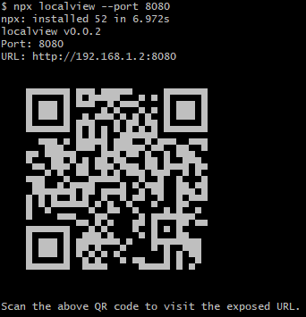

# localview

Easily access a localhost website from your mobile device.

## Usage

1. Start your localhost website
2. Create a QR code with localview

```bash
npx localview --port 8080
```



3. Scan the code with your mobile device to visit the URL.

## Notes

- Both the server and the mobile device need to be connected to the same network.
- You may need to set you server's host to 0.0.0.0.

## License

[MIT](https://opensource.org/licenses/MIT)
