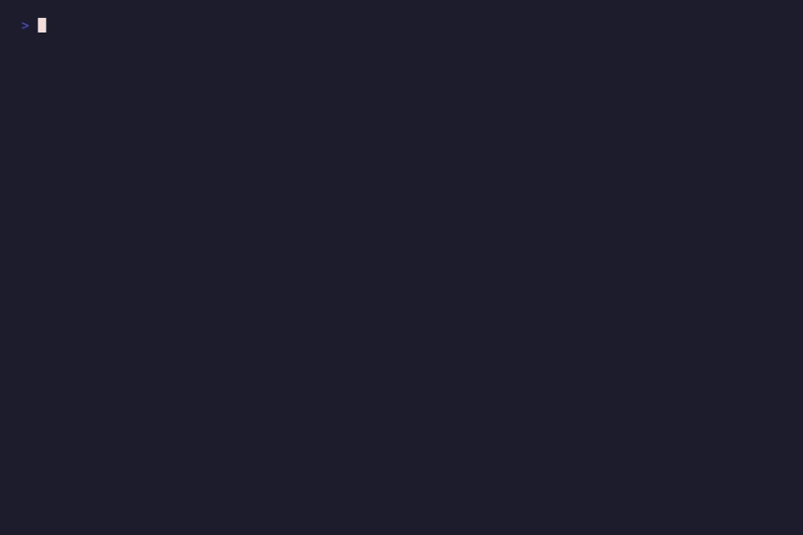

# localview

Open your local dev server on your phone with a QR scan.

`localview` finds your machine's LAN IP, builds a URL pointing at your dev server's port, and prints a QR code in the terminal. Scan it from any device on the same network. No tunnels, no signup, no daemon.



## Quick start

1. Start your dev server.
2. In a separate terminal, run `localview` with the same port:

   ```bash
   npx localview --port 8080
   ```

3. Scan the QR code with your phone's camera. The page opens in the default browser.

## Use cases

- **Mobile UI checks**: touch targets, breakpoints, virtual keyboards, and the OS chrome that desktop devtools approximations can't fully replicate.
- **Real-device APIs**: `getUserMedia`, geolocation, device orientation, `vibrate`, and other sensor or permission flows that only work on a real phone.
- **PWA install flow**: Add-to-home-screen prompts, splash screens, standalone-mode display.
- **Multi-device review**: hand the QR to a teammate or designer on the same wifi; they're on your branch in seconds, no deploy needed.
- **Cross-browser sanity**: catch mobile Safari and Android Chrome quirks before pushing to staging.

## Options

| Flag           | Description                                                   |
| -------------- | ------------------------------------------------------------- |
| `--port`, `-P` | Port your dev server is bound to. **Required.**               |
| `--path`       | Path appended to the URL (e.g. `/admin`).                     |
| `--host`       | Override the auto-detected LAN IP (Docker, multi-NIC, demos). |

### Examples

```bash
# Deep-link to a specific route:
npx localview --port 3000 --path /admin

# Pin the LAN IP yourself instead of auto-detecting:
npx localview --port 8080 --host 192.168.1.42
```

If your machine has multiple LAN interfaces (wifi + VPN + Docker bridges, for example), `localview` shows an interactive picker with arrow-key navigation. The smart-sorted default (wifi and ethernet first) is selected by pressing Enter.

## Requirements

- Node.js `^20.19.0`, `^22.12.0`, or `>=23`.
- Your dev server and your phone connected to the same network.
- Your dev server must accept connections from its LAN address. Many frameworks bind to `127.0.0.1` only by default; bind to `0.0.0.0` instead (the exact flag depends on your tool: `--host 0.0.0.0`, `--bind 0.0.0.0`, `HOST=0.0.0.0`, etc.) to expose it on the LAN.

## License

[MIT](https://opensource.org/licenses/MIT)
